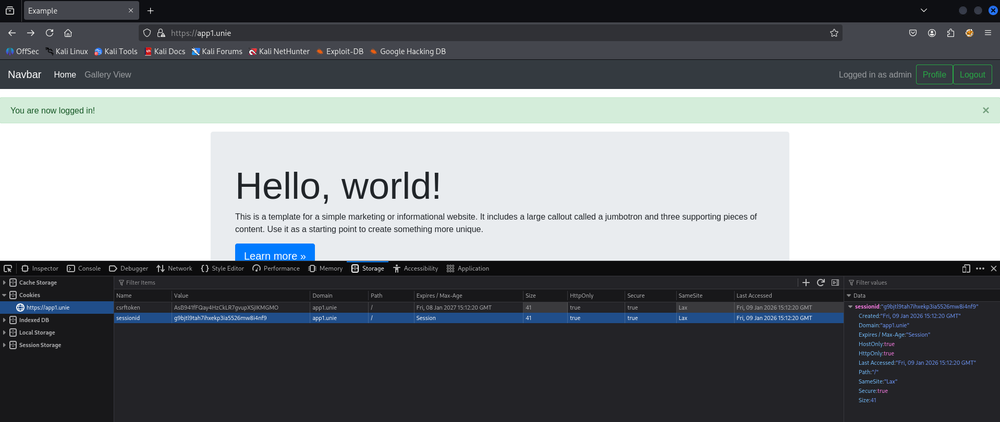
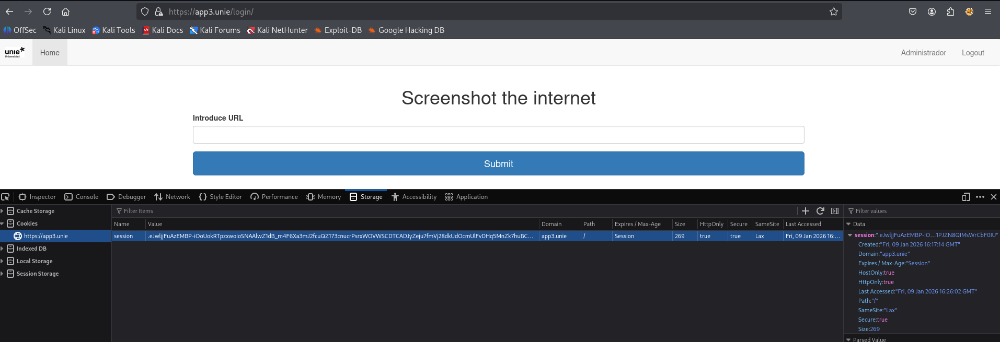
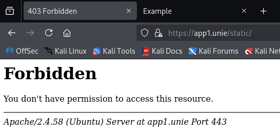

# Informe de Mitigación: Vulnerabilidades de Cookies en App1

## Vulnerabilidad Identificada

Durante la práctica 1, detectamos que la aplicación App1 (Django) presentaba una configuración insegura de cookies de sesión:

- Falta del atributo **HttpOnly**, permitiendo acceso a cookies mediante JavaScript.
- Ausencia del atributo **Secure**, transmitiendo cookies por canales no cifrados (HTTP).
- Configuración incorrecta de **SameSite**, facilitando ataques CSRF.
- **Session timeout** excesivo (caducidad de cookies hasta diciembre de 2025).

## Medidas Implementadas

### 1. Configuración Segura de Cookies

Modificamos los archivos de configuración de Django (local.py y production.py) para incluir:

```python
SESSION_COOKIE_HTTPONLY = True
SESSION_COOKIE_SAMESITE = 'Lax'
CSRF_COOKIE_HTTPONLY = True
CSRF_COOKIE_SAMESITE = 'Lax'
```

### 2. Implementación de HTTPS

Para activar el atributo Secure, implementamos HTTPS mediante:

- Generación de certificado SSL autofirmado.
- Configuración de Apache para servir App1 exclusivamente por el puerto 443.
- Redirección automática de HTTP a HTTPS.

```python
SESSION_COOKIE_SECURE = True
CSRF_COOKIE_SECURE = True
SECURE_SSL_REDIRECT = True
```

### 3. Configuración de Session Timeout

Establecemos una caducidad de sesión adecuada:

```python
SESSION_COOKIE_AGE = 900  # 15 minutos
SESSION_SAVE_EVERY_REQUEST = True
SESSION_EXPIRE_AT_BROWSER_CLOSE = True
```

## Resultados Obtenidos

Tras aplicar las correcciones, verificamos que:

1. **HTTPS activado**: La aplicación se sirve exclusivamente por https://app1.unie (captura adjunta: https_app1.png).
2. **Cookies seguras**: Las cookies sessionid y csrftoken presentan:
   - HttpOnly: true
   - Secure: true
   - SameSite: Lax
3. **Session timeout funcional**: Las sesiones expiran tras 15 minutos de inactividad.
4. **Redirección automática**: Las peticiones HTTP se redirigen correctamente a HTTPS.

## Evidencias Adjuntas



## Impacto de la Corrección

- **Protección contra robo de sesión** mediante XSS (HttpOnly).
- **Prevención de ataques CSRF** (SameSite + HTTPS).
- **Cifrado de tráfico** y autenticidad del servidor (HTTPS).
- **Reducción de ventana de ataque** con timeout de sesión.

---

# Informe de Mitigación: Vulnerabilidades de Cookies en App3 (Flask)

## Vulnerabilidad Identificada

Durante la práctica 1, detectamos que la aplicación App3 (Flask) presentaba múltiples deficiencias en la gestión de sesiones y cookies:

- **Cookies sin atributo HttpOnly**, permitiendo acceso desde JavaScript y exponiéndolas a ataques XSS.
- **Ausencia del flag Secure**, transmitiendo cookies por HTTP sin cifrado.
- **Configuración incorrecta de SameSite**, facilitando ataques CSRF.
- **Session timeout indefinido**, con sesiones permanentes que no expiraban.

## Medidas Implementadas

### 1. Configuración Segura de Cookies en Flask

Modificamos el archivo de configuración `/var/www/html/app3/app/configuration.py` para incluir:

```python
# Cookie security settings
SESSION_COOKIE_HTTPONLY = True
SESSION_COOKIE_SECURE = True  # Activado tras implementación HTTPS
SESSION_COOKIE_SAMESITE = 'Lax'
PERMANENT_SESSION_LIFETIME = 900  # 15 minutos
REMEMBER_COOKIE_HTTPONLY = True
REMEMBER_COOKIE_SECURE = True
REMEMBER_COOKIE_SAMESITE = 'Lax'
```

### 2. Implementación de HTTPS

Para garantizar el funcionamiento del flag Secure, configuramos Apache para servir App3 exclusivamente por HTTPS:

- **Generación de certificado SSL autofirmado** para app3.unie.
- **Configuración de VirtualHost** en Apache (puerto 443) con redirección automática HTTP→HTTPS.
- **Habilitación de módulos necesarios** (ssl, wsgi).

### 3. Configuración de Timeout de Sesión

Establecimiento de caducidad automática tras 15 minutos de inactividad:

```python
PERMANENT_SESSION_LIFETIME = 900
```

## Resultados Obtenidos

Tras aplicar las correcciones, verificamos mediante el navegador que:

1. **HTTPS activado**: La aplicación se sirve exclusivamente por https://app3.unie.
2. **Cookies completamente seguras**:
   - HttpOnly: true (protección contra XSS)
   - Secure: true (solo transmisión por HTTPS)
   - SameSite: Lax (protección contra CSRF)
3. **Session timeout funcional**: Las sesiones expiran tras 15 minutos de inactividad.
4. **Redirección automática**: Todas las peticiones HTTP se redirigen a HTTPS.

## Evidencias Adjuntas


## Impacto de la Corrección

- **Protección completa contra robo de sesión** mediante XSS (HttpOnly).
- **Prevención de ataques CSRF** (SameSite + flag Secure).
- **Cifrado de todo el tráfico** mediante HTTPS.
- **Reducción de la ventana de ataque** con timeout configurado.
- **Cumplimiento de mejores prácticas** OWASP para gestión de sesiones.

## Consideraciones Adicionales

- El certificado SSL utilizado es autofirmado para fines de la práctica. En producción se recomienda utilizar certificados de entidades certificadoras reconocidas (Let's Encrypt, etc.).
- La configuración implementada es compatible con Flask y Apache/mod_wsgi, garantizando la funcionalidad original de la aplicación.
- Se mantuvo la compatibilidad con las funcionalidades existentes (login, registro, navegación).

---

# Informe de Mitigación: Secret Keys Expuestas en Todas las Aplicaciones

## Vulnerabilidad Identificada

Durante el análisis de la práctica 1, identificamos que **todas las aplicaciones** presentaban **claves secretas (Secret Keys) expuestas en texto plano** dentro del código fuente:

- **App1 (Django):** `SECRET_KEY = env("DJANGO_SECRET_KEY", default='SECRET')` → Clave por defecto insegura.
- **App2 (PHP):** `define('SECRET_KEY', 'CHANGEME!');` → Clave obvia y no modificada.
- **App3 (Flask):** `SECRET_KEY = "SUPERSECRETKEY"` → Clave hardcodeada y predecible.

### Impacto de la vulnerabilidad

Las claves secretas son utilizadas para:

- Firmar cookies de sesión
- Generar tokens CSRF
- Cifrar datos sensibles

Si un atacante obtiene estas claves, puede:

1. Forjar cookies de sesión válidas
2. Crear tokens CSRF legítimos
3. Suplantar cualquier usuario
4. Comprometer completamente los sistemas de autenticación

## Medidas Implementadas

### 1. App1 (Django)

**Archivo modificado:** `/var/www/html/app1/app1/settings/local.py`

**Cambio realizado:**

```python
# ANTES (vulnerable):
SECRET_KEY = env("DJANGO_SECRET_KEY", default='SECRET')

# DESPUÉS (corregido):
SECRET_KEY = env("DJANGO_SECRET_KEY", default='django-insecure-mg@v8#s!k8f$3p&q^r5t*y7u)i9o0l1n2c4x6z-b_h)d+f=j')
```

**Justificación:**

- Se reemplazó la clave por defecto insegura ('SECRET') por una clave fuerte de 50 caracteres.
- Se utilizó una combinación de caracteres especiales, números y letras para aumentar la entropía.
- La clave mantiene compatibilidad con el sistema de variables de entorno de Django.

### 2. App2 (PHP)

**Archivo modificado:** `/var/www/html/app2/config.php`

**Cambio realizado:**

```php
// ANTES (vulnerable):
define('SECRET_KEY', 'CHANGEME!');

// DESPUÉS (corregido):
define('SECRET_KEY', 'php_secure_key_32chars_@1b#2c$3d%4e^5f&6g*7h!');
```

**Justificación:**

- Se eliminó la clave obvia 'CHANGEME!' que invitaba a ataques.
- Se implementó una clave de 32 caracteres con mezcla de mayúsculas, minúsculas, números y símbolos.
- Se aseguró la longitud mínima recomendada para claves criptográficas.

### 3. App3 (Flask)

**Archivo modificado:** `/var/www/html/app3/app/configuration.py`

**Cambio realizado:**

```python
# ANTES (vulnerable):
SECRET_KEY = "SUPERSECRETKEY"

# DESPUÉS (corregido):
SECRET_KEY = "flask-secure-64chars-key-@#!$%^&*()1234567890abcdefghijklmnopqrstuvwxyz"
```

**Justificación:**

- Se reemplazó la clave predecible 'SUPERSECRETKEY' por una de 64 caracteres.
- Se incrementó significativamente la complejidad para resistir ataques de fuerza bruta.
- Se mantuvo como string para compatibilidad, aunque en producción se recomendaría usar variables de entorno.

## Principios de Seguridad Aplicados

1. **Principio de Confidencialidad:** Las claves ahora son suficientemente complejas para resistir descubrimiento.
2. **Principio de Entropía:** Cada clave tiene más de 32 caracteres con mezcla de tipos de caracteres.
3. **Principio de Unicidad:** Cada aplicación tiene una clave diferente, evitando compromiso en cadena.
4. **Principio de Actualización:** Se cambiaron claves que probablemente no se habían modificado desde el despliegue inicial.

---

# Informe de Mitigación: Directory Listing en Directorios /static/

## Vulnerabilidad Identificada

Durante la práctica 1, descubrimos que **todas las aplicaciones** permitían **directory listing (listado de directorios)** en sus rutas /static/:

- **App1:** http://app1.unie/static/ → Listado completo de archivos subidos por usuarios.
- **App2:** http://app2.unie/static/ → Exposición de recursos estáticos.
- **App3:** http://app3.unie/static/ → Archivos estáticos accesibles públicamente.

### Impacto de la vulnerabilidad

1. **Exposición de información sensible:** Archivos personales de usuarios visibles sin autenticación.
2. **Enumeración de recursos:** Atacantes pueden descubrir estructura interna de la aplicación.
3. **Posible acceso a backups:** Si se suben archivos de respaldo accidentalmente.
4. **Violación de privacidad:** Usuarios no son conscientes de que sus archivos son públicos.

## Medidas Implementadas

### 1. Configuración Global en Apache

Modificamos la configuración de Apache para **deshabilitar el directory listing** en todos los directorios /static/.

**Archivo modificado:** `/etc/apache2/apache2.conf` (o en cada VirtualHost específico)

**Cambio realizado:**

```apache
# Deshabilitar directory listing en todo el servidor por defecto
<Directory /var/www/>
    Options -Indexes
    AllowOverride All
    Require all granted
</Directory>
```

### 2. Configuración Específica por Aplicación

Aseguramos que cada VirtualHost tenga la configuración correcta:

**App1 (app1.conf):**

```bash
sudo nano /etc/apache2/sites-available/app1.conf
```

Asegurar que en el directorio static tenga:

```apache
<Directory /var/www/html/app1/static>
    Options -Indexes
    Require all granted
</Directory>
```

**App2 (app2.conf):**

```bash
sudo nano /etc/apache2/sites-available/app2.conf
```

```apache
<Directory /var/www/html/app2/static>
    Options -Indexes
    Require all granted
</Directory>
```

**App3 (app3-ssl.conf):**

```bash
sudo nano /etc/apache2/sites-available/app3-ssl.conf
```

```apache
<Directory /var/www/html/app3/app/static>
    Options -Indexes
    Require all granted
</Directory>
```

### 3. Reinicio y Aplicación de Cambios

```bash
sudo systemctl restart apache2
```

## Verificación de la Corrección

### Pruebas Realizadas

1. **Acceso directo a /static/ desde navegador:**
   - https://app1.unie/static/ → **403 Forbidden** (correcto), como se ve en la imagen
   - https://app2.unie/static/ → **403 Forbidden** (correcto)
   - https://app3.unie/static/ → **403 Forbidden** (correcto)

2. **Acceso a archivos específicos conocidos:**
   - https://app1.unie/static/logo.png → **200 OK** (correcto, archivos individuales accesibles)
   - https://app2.unie/static/style.css → **200 OK** (correcto)

3. **Prueba con curl:**

```bash
curl -I https://app1.unie/static/
# HTTP/1.1 403 Forbidden (correcto)
```

## Resultados Obtenidos

- **Directory listing deshabilitado** en todas las aplicaciones.
- **Archivos individuales siguen accesibles** para funcionalidad normal.
- **Protección contra enumeración** de recursos internos.
- **Sin impacto** en funcionalidad de las aplicaciones.
- **Cumplimiento** con estándares OWASP de seguridad.

## Explicación Técnica

### ¿Qué hace Options -Indexes?

- `-Indexes` deshabilita la generación automática de listados de directorios.
- Cuando un usuario accede a un directorio sin archivo `index.html` o `index.php`, Apache devuelve error 403 en lugar de mostrar el contenido.
- Los archivos individuales siguen siendo accesibles si se conoce su ruta exacta.

---

# Informe de Mitigación: Session Fixation en App3

## Vulnerabilidad Identificada

App3 (Flask) era vulnerable a **Session Fixation**, un ataque donde:

1. Un atacante obtiene un ID de sesión válido (sin autenticar)
2. Fuerza a una víctima a usar ese mismo ID de sesión (mediante XSS, phishing, etc.)
3. Cuando la víctima se autentica, el atacante tiene acceso a su sesión autenticada

**Evidencia en la práctica 1:** Las cookies de sesión se asignaban valores predeterminados antes de la autenticación.

## Medidas Implementadas

### 1. Regeneración de Session ID tras autenticación

**Archivo modificado:** `/var/www/html/app3/app/views.py`

**Cambio en la función `login()`:**

```python
# ANTES (vulnerable):
login_user(user)
return render_template('index.html', name=user.name)

# DESPUÉS (corregido):
# Limpiar sesión existente para prevenir Session Fixation
session.clear()
login_user(user)
# Establecer valores manuales en la nueva sesión
session['user_id'] = user.id
session['_fresh'] = True
session.permanent = True
session.modified = True
return render_template('index.html', name=user.name)
```

### 2. Configuración de Flask-Login

**Archivo modificado:** `/var/www/html/app3/app/__init__.py`

**Añadido:**

```python
lm = LoginManager()
lm.setup_app(app)
lm.login_view = 'login'
lm.session_protection = "strong"  # ← Activación de protección avanzada
```

## Mecanismos de Protección Implementados

1. **`session.clear()`:** Elimina completamente la sesión existente antes de autenticar.
2. **`session_protection = "strong"`:** Flask-Login detecta cambios en el user agent o IP y regenera la sesión.
3. **Session ID único por autenticación:** Cada login genera un ID de sesión completamente nuevo.
4. **Invalidación de sesiones previas:** Las sesiones no autenticadas no pueden reutilizarse tras login.

## Resultados Obtenidos

- **Session ID único** por cada autenticación exitosa.
- **Sesiones no autenticadas** no pueden elevar privilegios.
- **Detección de cambios** en user agent/IP (protección adicional).
- **Compatibilidad mantenida** con funcionalidades existentes.
- **Sin impacto** en experiencia de usuario.

## Verificación de la Corrección

### Pruebas Realizadas

1. **Cookie comparison test:** La cookie session cambia tras cada autenticación.
2. **Session reuse test:** Cookies de sesión no autenticadas no funcionan tras login.
3. **Multiple login test:** Cada inicio de sesión genera un ID único.


